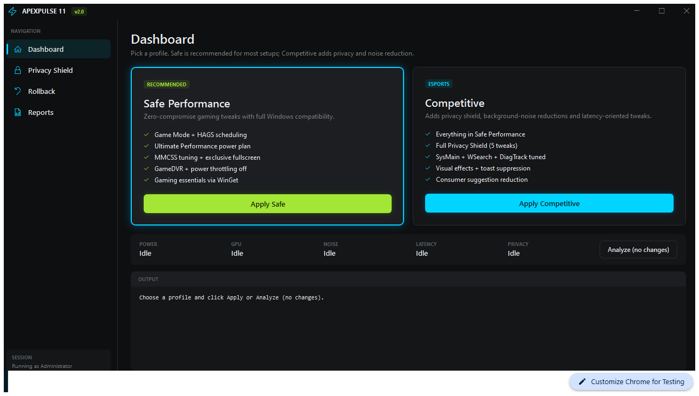
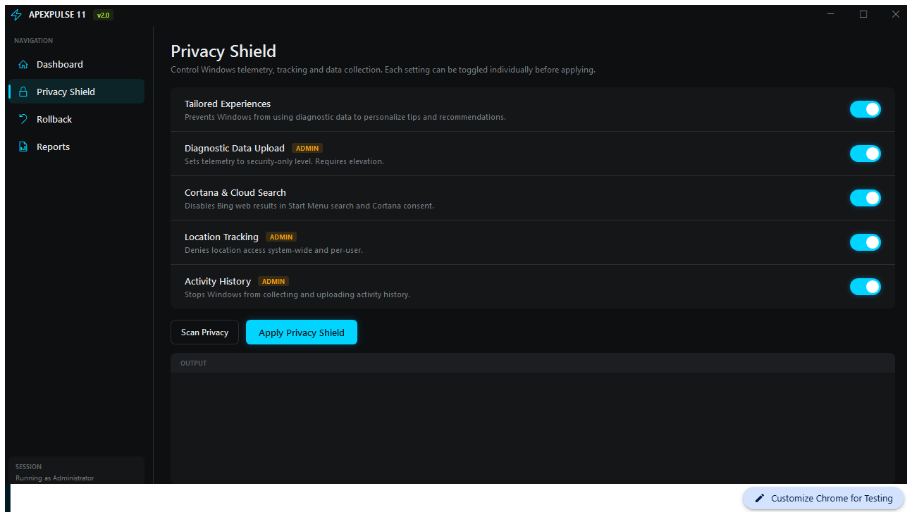
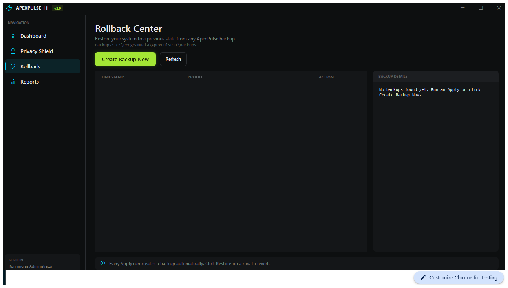

<div align="center">

# ApexPulse 11

**Windows 11 Gaming Optimizer with Privacy Shield, Rollback & Reports**

[](LICENSE)
[](https://docs.microsoft.com/powershell/)
[](https://www.microsoft.com/windows/windows-11)
[](#ltsc-notes)

---

*Safe by default. Competitive by choice. Restore when needed.*

</div>

---

## What It Does

ApexPulse 11 is a PowerShell/WPF optimizer for Windows 11 gaming PCs. It ships two curated profiles, an integrated privacy shield, full registry backup with one-click rollback, and timestamped HTML reports — all behind a modern dark-themed UI.

> Formerly **Win11 GameBoost** / **ltsc-setup**. Same repo, new identity.

---

## Screenshots

<!-- Replace the placeholders below with actual screenshots or GIFs of the WPF UI. -->

| Dashboard | Privacy Shield | Rollback Center |
|:---------:|:--------------:|:---------------:|
|  |  |  |

> **Note:** Screenshots coming soon. Launch `.\ApexPulse.ps1` to see the live UI.

---

## Features

| Category | Highlights |
|----------|-----------|
| **Profiles** | Safe Performance (zero-compromise gaming) and Competitive (privacy + noise reduction) |
| **Privacy Shield** | Tailored experiences, diagnostic data, Cortana/cloud search, location tracking, activity history |
| **Rollback** | Full registry backup + Windows restore point before every apply; one-click restore from any backup |
| **Reports** | Timestamped JSON + HTML reports written to `%ProgramData%\ApexPulse11\Reports` |
| **Packages** | Installs gaming essentials via WinGet (Steam, Discord, Xbox App, 7-Zip, and more) |
| **LTSC** | Bootstraps WinGet and Microsoft Store when missing on LTSC builds |

---

## Quick Start

Open **PowerShell as Administrator**:

```powershell
Set-ExecutionPolicy -Scope Process Bypass -Force
.\ApexPulse.ps1
```

This launches the WPF GUI. For headless / automation usage:

```powershell
# Analyze (read-only scan)
.\ApexPulse.ps1 -Profile Safe -Mode Analyze -NoUi

# Apply Safe optimizations
.\ApexPulse.ps1 -Profile Safe -Mode Apply -NoUi

# Apply Competitive (includes Privacy Shield)
.\ApexPulse.ps1 -Profile Competitive -Mode Apply -NoUi

# Restore from a backup
.\ApexPulse.ps1 -Mode Restore -BackupPath "C:\ProgramData\ApexPulse11\Backups\20260524-143000-Safe" -NoUi
```

### Legacy entry points

Both legacy files still work:

```powershell
.\setup.ps1 -Profile Safe -Mode Apply -NoUi
.\GameBoost.ps1 -Profile Safe -Mode Analyze -NoUi
```

---

## Profiles

| Profile | When to use | What it does |
|---------|------------|--------------|
| **Safe Performance** | Default for almost everyone | Enables Game Mode, disables GameDVR, activates high-performance power plan, tunes MMCSS, enables HAGS, prefers exclusive fullscreen, disables Game Bar overlay, disables power throttling, and installs gaming packages. |
| **Competitive** | Opt-in for leaner, privacy-hardened gaming sessions | Everything in Safe plus: consumer suggestion reduction, visual effects reduction, toast suppression, SysMain/WSearch/DiagTrack service management, **and the full Privacy Shield**. |

Safe Performance is designed to stay compatible with Microsoft Store, Game Pass, Windows Update, Defender, Firewall and anticheats. Competitive is still fully reversible, but more opinionated.

---

## Optimization Matrix

| Area | Safe | Competitive | Notes |
|------|:----:|:-----------:|-------|
| Game Mode | Yes | Yes | Enables Windows Game Mode for the current user. |
| Background recording | Yes | Yes | Disables GameDVR background capture. |
| Power plan | Yes | Yes | Activates Ultimate Performance when available, with High Performance fallback. |
| Multimedia scheduling | Yes | Yes | Tunes the Windows Games MMCSS profile. Reboot recommended. |
| HAGS | Yes | Yes | Requests hardware-accelerated GPU scheduling. Driver support decides behavior. |
| Exclusive fullscreen | Yes | Yes | Prefers exclusive fullscreen mode to bypass the DWM compositor. |
| Game Bar overlay | Yes | Yes | Disables the Game Bar overlay to eliminate micro-stutters. |
| Power throttling | Yes | Yes | Disables CPU power throttling for peak frequency. |
| Packages | Yes | Yes | Installs gaming essentials with WinGet. |
| Consumer suggestions | — | Yes | Reduces Windows suggestions and widget noise. |
| Visual effects | — | Yes | Disables transparency, animations and Aero Peek. |
| SysMain | — | Yes | Stops SysMain and sets it to Manual. |
| Windows Search | — | Yes | Stops WSearch and sets it to Manual. |
| Diagnostic tracking | — | Yes | Stops DiagTrack and sets it to Manual. |
| Notification toasts | — | Yes | Suppresses toast notifications. |

---

## Privacy Shield

The Privacy Shield is integrated into the Competitive profile and also available as a standalone panel in the UI.

| Feature | Admin Required | Detail |
|---------|:--------------:|--------|
| Tailored experiences | No | Disables diagnostic-data-based personalization. |
| Diagnostic data upload | Yes | Reduces telemetry to security-only level. |
| Cortana & cloud search | No | Disables Bing results in Start Menu and Cortana consent. |
| Location tracking | Yes | Denies location access system-wide and per-user. |
| Activity history | Yes | Disables activity feed collection and upload. |

---

## Safety & Rollback Model

1. **Analyze mode** does not apply changes — it is always read-only.
2. **Apply mode** requires Administrator for system-level optimizations.
3. Before applying, ApexPulse automatically:
   - Exports every registry path touched by the selected profile.
   - Snapshots individual registry values (to detect and revert newly created keys).
   - Captures service start modes and states.
   - Attempts a Windows System Restore Point.
4. Backups are stored under `%ProgramData%\ApexPulse11\Backups`.
5. Restore from the **Rollback Center** tab in the UI, or via CLI:
   ```powershell
   .\ApexPulse.ps1 -Mode Restore -BackupPath "<path-to-backup-folder>" -NoUi
   ```
6. Reports (JSON + HTML) are written to `%ProgramData%\ApexPulse11\Reports` after every run.

---

## What It Does NOT Do

ApexPulse 11 does **not** disable Defender, Firewall, Windows Update, Core Isolation/VBS, Secure Boot, TPM, anticheat services, or driver security features automatically. Those choices affect security, game compatibility and system support too much to hide behind a button.

---

## LTSC Notes

Windows 11 LTSC can miss components that normal Windows 11 installs already have. `packages.dsc.yaml` keeps the package baseline separate and repeatable through WinGet Configuration/DSC. If WinGet is missing, Apply mode attempts the same App Installer bootstrap path this repo originally used for LTSC, then runs `wsreset.exe -i` so Microsoft Store packages such as Xbox can resolve through `msstore`. If that fails, install Microsoft App Installer / Microsoft Store manually and run ApexPulse again.

Apply the package baseline manually:

```powershell
winget configure -f .\packages.dsc.yaml --accept-configuration-agreements --accept-source-agreements
```

---

## Files

| File | Purpose |
|------|---------|
| `ApexPulse.ps1` | Main UI, CLI, tweak engine, privacy shield, backup, restore and reporting. |
| `GameBoost.ps1` | Legacy redirect wrapper (forwards to `ApexPulse.ps1`). |
| `setup.ps1` | Compatibility wrapper for the old project entry point. |
| `packages.dsc.yaml` | WinGet Configuration package baseline. |
| `.github/workflows/release.yml` | CI: lint PowerShell scripts and build release zip on tag. |

---

## Building & CI

The project uses a GitHub Actions workflow that triggers on new tags:

```bash
git tag v2.0.0
git push origin v2.0.0
```

The workflow will:
1. Lint all `.ps1` files with `PSScriptAnalyzer`.
2. Bundle the project into a downloadable `ApexPulse11-<tag>.zip` release artifact.

---

## Official Windows Features Used

- [WinGet Configuration / DSC](https://learn.microsoft.com/windows/package-manager/configuration/)
- [Optimizations for windowed games](https://support.microsoft.com/windows/optimizations-for-windowed-games-in-windows-11-3f006843-2c7e-4ed0-9a5e-f9389e535952)
- [Auto HDR](https://support.microsoft.com/windows/use-auto-hdr-for-better-gaming-in-windows-0cce8402-3de5-4512-a742-e027ca7aa79c)
- [Power mode](https://support.microsoft.com/windows/change-the-power-mode-for-your-windows-pc-c2aff038-22c9-f46d-5ca0-78696fdf2de8)

---

## License

MIT.
